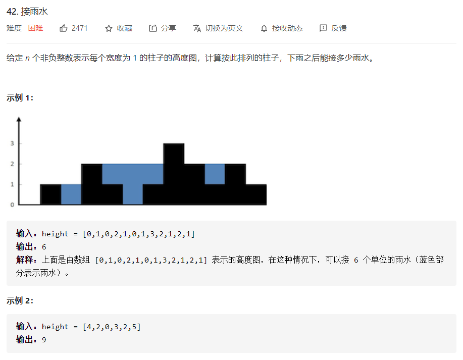
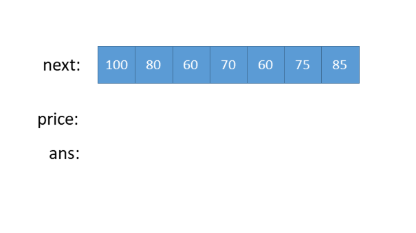

# 数据结构与算法 - 单调栈


### 性质
- 单调递减栈，能表示入栈元素左边第一个比它大的元素。入栈表明本身比栈顶小，出栈表面本身比栈顶大；
- 单调递增栈，能表示入栈元素左边第一个比它小的元素。入栈表明本身比栈顶大，出栈表面本身比栈顶小；

### 例题 1 - 接雨水
<https://leetcode-cn.com/problems/trapping-rain-water/>


```
class Solution:
    def trap(self, height: List[int]) -> int:
        if len(height) == 0:
            return 0
        sumArea = 0
        stack = []
        for right in range(len(height)):
            while stack and height[stack[-1]] < height[right]:
                if len(stack) >= 2:
                    bottom = stack.pop()
                    left = stack[-1]
                    waterHeight = min(height[right], height[left]) - height[bottom]
                    waterWidth = right - left - 1
                    currArea = waterHeight*waterWidth
                    sumArea += currArea
                else:
                    stack.pop()
            stack.append(right)
        return sumArea
```

### 例题 2 - 股票价格跨度
<https://leetcode-cn.com/problems/online-stock-span/>


```
class StockSpanner:

    def __init__(self):
        self.stack = []

    def next(self, price: int) -> int:
        if not self.stack or self.stack[-1][0] > price:
            self.stack.append((price, 1))
            return 1

        ans = 1
        while self.stack and self.stack[-1][0] <= price:
            bottom = self.stack.pop()
            ans += bottom[1]
        self.stack.append((price, ans))
        return ans

# Your StockSpanner object will be instantiated and called as such:
# obj = StockSpanner()
# param_1 = obj.next(price)
```
